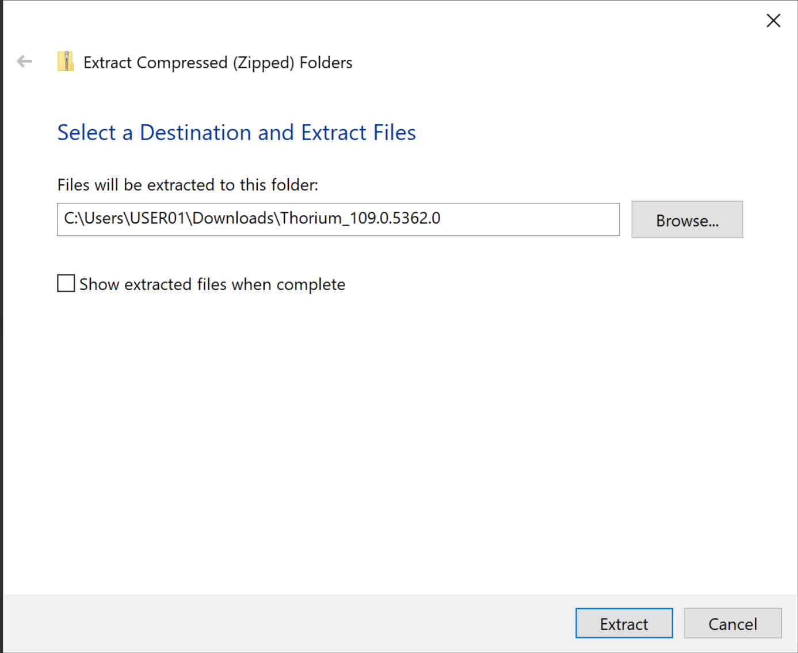
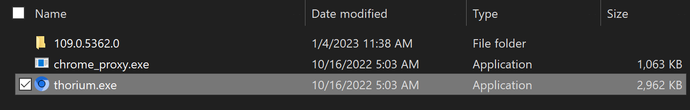

# Sophos Bypass
### How to bypass Sophos web protection
</img>
 
- First you will need to download [Thorium Browser](https://thorium.rocks)  (A Chromium fork with minor compiler optimizations)  
  #### [⬇️ Download the Portable Zip here](https://github.com/Alex313031/Thorium-Win/releases/download/M109.0.5362.0/Thorium_109.0.5362.0.zip)
- Wait for the file to finish downloading then open it in File Explorer    
</img>
- Right click on the file and Extract All  
</img>
- Extract the file in the current directory and then open it  
</img>
- Open the `BIN` folder   
</img>
- Then run `thorium.exe` executable  
</img>
